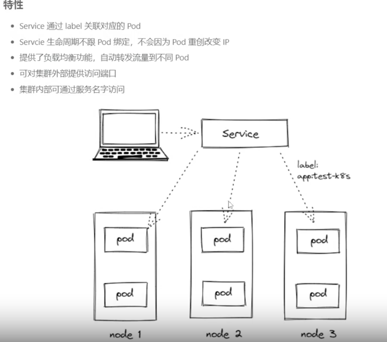

`!/bin/zsh`

## 断口映射 
    类似docker -p

    kubectl port-forward test-at-cc88cc7cd-5xncv 8081:8080
    
    kubectl get pod test-at -o wides

    kubectl get deployment test-at-cc88cc7cd-5xncv -o yaml >> app.yaml

## Deployment 
    适合无状态的应用，与pod等价，可替代
## StatefuSet 
    有状态应用，适合数据库这类应用
## DaemonSet  
    在每一个节点上跑一个Pod,适合做节点监控，节点日志收集等
## Job & CronJob 
    Job是用来表达一次的任务，而CronJob会根据其时间规划反复运行


## Service


- 创建Service

service.yaml
```
apiVersion: v1
kind: Service
metadata:
  name: sernet
spec:
  selector:
    app: sernet
  type: ClusterIP
  ports:
    - port: 8080  #本Service 的端口
      targetPort: 8080  #容器端口

```

``` kubectl apply -f service.yanl
    kubectl get svc
    kubectl describe svc test-at
```
#
```
# kubectl apply -f service.yanl

apiVersion: v1
kind: Service
metadata:
  name: test-at
spec:
  selector:
    app: test-at
  type: NodePort
  ports:
    - port: 8081  #本转发在 集群内Service 的端口
      targetPort: 8080  #容器端口 Pod内的端口
      nodePort: 30001   #转发在node 上的端口
      
```

kubectl describe svc test-at